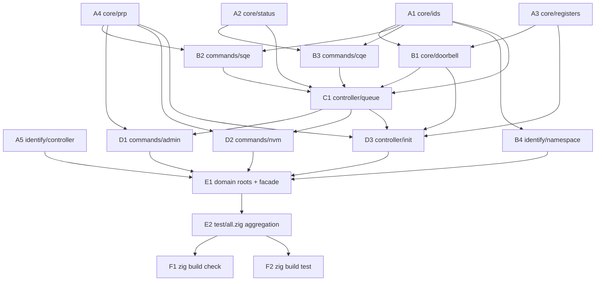

## Ephemeral implementation plan

Non-normative. This document tracks the agentic execution of the initial
implementation slice across the 20 approved specs. It is deleted or archived
once every phase-F gate passes; nothing in this file overrides a spec.

Authority order (per `docs/guidelines/conventions.md`): specs > conventions >
zig baseline > this file.

## Ruling: layering exception for admin/nvm

`docs/specs/architecture.md` §"Layering" originally forbade `commands ->
controller`. `docs/specs/commands/admin.md` §"stdx composition" and
`docs/specs/commands/nvm.md` §"stdx composition" — both approved after
architecture.md — explicitly compose `controller.queue.SubmissionQueue`
inside their builder factories.

Ruling: the per-command specs are the more specific authority. The edge
`commands.admin -> controller.queue` and `commands.nvm -> controller.queue`
is spec-authorized. The graph stays acyclic (`controller/queue.zig` never
imports `commands/admin.zig` or `commands/nvm.zig`). `docs/decisions.md`
carries the resolved-question entry; `docs/specs/architecture.md`
§"Layering" is updated in the same landing to remove the contradiction.

## Slice DAG

## Phase A — Core leaves (5-way parallel)

Every slice = `src/**/<name>.zig` + `test/**/<name>_test.zig` landing together.

- **A1 `src/core/ids.zig`** — `docs/specs/core/ids.md`.
  - Imports: `std`, `stdx.tags`.
  - Tests: `test/core/ids_test.zig`.
- **A2 `src/core/status.zig`** — `docs/specs/core/status.md`.
  - Imports: `std`.
  - Tests: `test/core/status_test.zig`.
- **A3 `src/core/registers.zig`** — `docs/specs/core/registers.md`.
  - Imports: `std`, `stdx.io.Mmio`, `stdx.addr.DmaAddr`.
  - Tests: `test/core/registers_test.zig`.
- **A4 `src/core/prp.zig`** — `docs/specs/core/prp.md`.
  - Imports: `std`, `stdx.dma`, `stdx.addr.DmaAddr`.
  - Tests: `test/core/prp_test.zig`.
- **A5 `src/identify/controller.zig`** — `docs/specs/identify/controller.md`.
  - Imports: `std`.
  - Tests: `test/identify/controller_test.zig`.
  - Fixture: `test/fixtures/identify/controller_minimal.{bin,regen.zig}`.

`docs/specs/core/dma.md` is a delegation record only — no source file lands.

Phase-A gate: `zig build check` (proves wire-layout comptime assertions on
`x86_64-freestanding-none`).

## Phase B — First-order composition (4-way parallel after A)

- **B1 `src/core/doorbell.zig`** — deps: A1, A3. Tests: `test/core/doorbell_test.zig`.
- **B2 `src/commands/sqe.zig`** — deps: A1, A4. Tests: `test/commands/sqe_test.zig`.
  Fixture: `test/fixtures/commands/sqe_identify_controller.{bin,regen.zig}`.
- **B3 `src/commands/cqe.zig`** — deps: A1, A2. Tests: `test/commands/cqe_test.zig`.
  Fixture: `test/fixtures/commands/cqe_success.{bin,regen.zig}`.
- **B4 `src/identify/namespace.zig`** — deps: A1. Tests: `test/identify/namespace_test.zig`.
  Fixtures: `test/fixtures/identify/namespace_512e_minimal.{bin,regen.zig}`,
  `namespace_4kn_minimal.*`, `list_two_active.*`, `list_dense_1024.*`.

Phase-B gate: `zig build check && zig build test` — A+B modules only.

## Phase C — Queue mechanics (serial, blocking)

- **C1 `src/controller/queue.zig`** — deps: A1, A2, B1, B2, B3;
  stdx: `tags.TagAllocator.Bounded`, `dma.Buffer`, `time.Clock.Monotonic` +
  `Deadline` + `Backoff`, `io.poll.until`, `barrier.dma`, `barrier.mmio`.
  Tests: `test/controller/queue_test.zig`.
  Tester delegation split into three sub-tasks (SubmissionQueue,
  CompletionQueue(Backend), Pair(Backend)+RequestTable) but one file lands.

Phase-C gate: `zig build test`. Covers NVMe queue-ring coverage floor
(SQ-full, CQ-empty, phase-tag wrap, doorbell arithmetic).

## Phase D — State machine + command builders (3-way parallel after C)

- **D1 `src/commands/admin.zig`** — deps: A1, A4, B2, C1. Tests: `test/commands/admin_test.zig`.
- **D2 `src/commands/nvm.zig`** — deps: A1, A4, B2, C1. Tests: `test/commands/nvm_test.zig`.
- **D3 `src/controller/init.zig`** — deps: A3, A4, B1, B2, B3, C1;
  stdx: `time.*`, `io.poll.until`, `barrier.mmio`. Tests: `test/controller/init_test.zig`.

Phase-D gate: `zig build test`.

## Phase E — Public facade + aggregation (serial after D)

- **E1** — `src/core/root.zig`, `src/controller/root.zig`,
  `src/commands/root.zig`, `src/identify/root.zig`; rewrite `src/nvme.zig`
  to the Approved API from `docs/specs/architecture.md` §"Public package
  facade" (re-exports only). No root promotion yet — no spec approves
  promoted names.
- **E2** — `test/all.zig` gets 13 `_ = @import("...")` lines matching the
  test-strategy manifest.

## Phase F — Verification (serial after E)

- F1: `zig build check`.
- F2: `zig build test`.
- F3: audit `test/**` against `docs/specs/verification/test-strategy.md`
  §"Manifest" and the `unit:` / `golden:` / `malformed:` / `roundtrip:`
  prefix rule.

## Execution rules

- One `task` implementer + one `Tester` per slice. Implementer publishes
  `src/**` first, IRCs the Tester with the file path, Tester authors the
  paired `test/**/<name>_test.zig`. Slice is complete only when both files
  land and the phase gate passes.
- Fixture regeneration programs (`_regen.zig`) compose the same znvme
  builders they encode; `zig run` reproduces the `.bin` bytes exactly.
- Formatters and project-wide lints run once at Phase F, not per slice.
- Standard gate command: `zig build test && zig build check`.

## Progress ledger

- [x] Phase A — 5/5 slices landed. Gate passed: 83/83 tests, `zig build check` clean. Facade + roots + `test/all.zig` seeded. `build.zig` gained a `stdx` import on the tests module (test-strategy §"stdx composition") and an `audit_options` step exposing `src/identify/controller.zig` bytes to the A5 barrier-audit test. Golden fixture `test/fixtures/identify/controller_minimal.bin` (4096 bytes, md5 `3e15ae262d5f150d5fc65ffb93ae8b32`) plus `_regen.zig` landed.
- [x] Phase B — 4/4 slices landed. Gate passed: 198/198 tests, `zig build check` clean, `zig fmt --check` silent. Aggregators updated (`src/core/root.zig`, `src/commands/root.zig`, `src/identify/root.zig`, `test/all.zig`). Six golden fixtures landed: `test/fixtures/commands/{sqe_identify_controller,cqe_success}.bin` and `test/fixtures/identify/{namespace_512e_minimal,namespace_4kn_minimal,list_two_active,list_dense_1024}.bin`. Reviewer pass identified four findings; three landed (module-level `max_list_entries` removed, decorative banners deleted, unused `Cid`/`Nsid` aliases dropped), one deferred (spec-inconsistency around `numberOfLbaFormats` behavior when device sends NLBAF > 63 — spec Approved API snippet doesn't compile as written; behavior on out-of-domain values needs an ADR).
- [x] Phase C — 1/1 slice landed. Gate passed: 260/260 tests, `zig build check` clean, `zig fmt --check` silent. Aggregators updated (`src/controller/root.zig` populated, `test/all.zig` gained `controller/queue_test.zig`). Two in-source hazard comments retained in `queue.zig` (drain-loop `count += 1` inline before wrap-break — Zig `while : (expr)` continue-expression does not fire on `break`; explicit `wrapped` boolean for phase-flip on head=0 full wrap). Three follow-up ADRs pending: (1) drain-loop wording amendment in queue.md §"Approved API"; (2) phase-flip wording amendment in queue.md §"Approved API"; (3) Pair.poll cq.head-advance behavior clarification between queue.md §"znvme behavior — completion" bullet 141 and §"Approved API" sketch.
- [ ] Phase D — 0/3 slices landed.
- [ ] Phase E — 0/2 slices landed.
- [ ] Phase F — 0/3 gates cleared.
